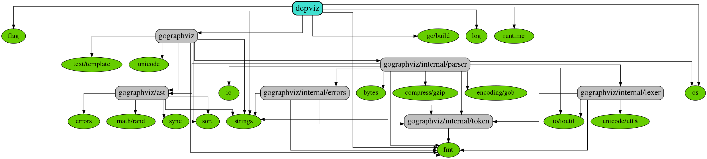

<!-- markdownlint-disable MD041 -->
<h1 align="center">:dvd: dependency visualization</h1>
<p align="center">
<!--  -->
<a href="https://github.com/jujili/depviz/releases"> </a>
<!--  -->
<a href="https://www.travis-ci.org/jujili/depviz"></a>
<!--  -->
<a href="https://codecov.io/gh/jujili/depviz"></a>
<!--  -->
<a href="https://goreportcard.com/report/github.com/jujili/depviz"></a>
<!--  -->
<a href="http://godoc.org/github.com/jujili/depviz"></a>
<!--  -->
<br/>
<!--  -->
<a href="https://github.com/jujili/depviz/blob/master/CHANGELOG.md"></a>
<!--  -->
<a href="https://golang.google.cn"></a>
<!--  -->
<a href="https://github.com/jujili/depviz/blob/master/LICENSE"></a>
<!--  -->
<br/>
<!--  -->
<a target="_blank" href="//shang.qq.com/wpa/qunwpa?idkey=7f61280435c41608fb8cb96cf8af7d31ef0007c44b223c9e3596ce84dec329bc"></a>
<!--  -->
<a href="https://mp.weixin.qq.com/s?__biz=MzA4MDU4NDI5Mw==&mid=2455230332&idx=1&sn=8086c43e259b0012596ed63d6ecd7d10&chksm=88017c76bf76f5604f2f3280ffd96029b5ccaf99db48d18066d3e3bc9bc8a2e1a05de1a3225f&mpshare=1&scene=1&srcid=&sharer_sharetime=1578553397373&sharer_shareid=5ce52651949258759d82d1bf31b455b5#rd"></a>
<!--  -->
<a href="https://zhuanlan.zhihu.com/jujili"></a>
<!--  -->
</p>

depviz 会把 Go 模块的依赖关系进可视化处理。

- [安装与更新](#%e5%ae%89%e8%a3%85%e4%b8%8e%e6%9b%b4%e6%96%b0)
- [使用](#%e4%bd%bf%e7%94%a8)
- [帮助](#%e5%b8%ae%e5%8a%a9)
- [详细说明](#%e8%af%a6%e7%bb%86%e8%af%b4%e6%98%8e)
	- [包分类](#%e5%8c%85%e5%88%86%e7%b1%bb)
	- [简化导入路径](#%e7%ae%80%e5%8c%96%e5%af%bc%e5%85%a5%e8%b7%af%e5%be%84)
- [参考文档](#%e5%8f%82%e8%80%83%e6%96%87%e6%a1%a3)

## 安装与更新

在命令行中输入以下内容，可以获取到最新版

```shell
$ go get -u github.com/jujili/depviz
$
```

## 使用



上图由以下命令生成。

```shell
$ depviz -s -o -d=github.com,jujili,awalterschulze . | dot -Tpng -o main.png
$
```

## 帮助

```shell
$ depviz -h
$
```

## 详细说明

### 包分类

`depviz` 会把库分成三类

- 感兴趣的（interested）：包含了初始库及其子库，还有利用 `--interested` 标记的库。例如， `--interested=github.com/jujili,github.com/aQuaYi` 会把导入路径以 `github.com/jujili` 或 `github.com/aQuaYi` 开头的库都标记为感兴趣的库。在图中，使用以蓝色方框显示。
- 标准库（standard）: 存放在 `GOROOT` 目录下的库，会被认为是标准库。使用 `-s` 来开启。在图中，以绿色圆形显示。注意，标准库只会是依赖图中的叶子节点。
- 其他库（other）：以上两类以外的其他库。使用 `-o` 来开启显示。在图中，以灰色方框显示。

### 简化导入路径

库文件的导入路径通常都比较长，为了简化显示，提供了 `-delete` 选项，可以简化为 `-d`。例如，`-d=github.com,jujili` 会把库 `github.com/jujili/clock/sub` 简化成 `clock/sub` 显示。
还可以直接使用 `-short` 选项，只显示库所在文件夹的名称。

## 参考文档

<https://graphviz.gitlab.io/_pages/doc/info/attrs.html>
